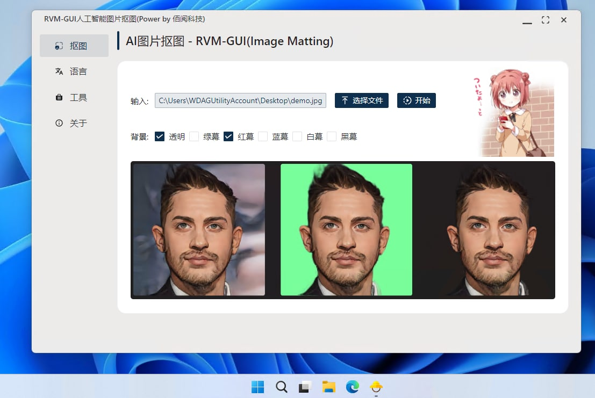

# RVM-GUI 人像抠图工具

【快捷入口：[综述](readme.md) # [RVM](rvm_gui.md) 】

## 软件截图：

## 效果演示：

## 软件特点

- 操作简单、即开即用
- 一键抠图
- 背景支持透明、绿幕、红幕、蓝幕、黑幕、白幕等
- 软件体积小，轻量便捷
- 支持vulkan GPU加速，低显存消耗
- 支持Windows(Mac、Linux后续补全)

## 使用场景：

- 任意人像抠图需求，证件照等

## 案例展示

### 视频处理

## 模型备注

## 下载地址：

方式1：[GitHub](https://github.com/Baiyuetribe/paper2gui/releases/tag/Published)
方式2：[阿里云盘](https://www.aliyundrive.com/s/2b4hyudGkni)

## 使用反馈：

请前往：https://github.com/Baiyuetribe/paper2gui/issues

## 参考

- [PeterL1n/RobustVideoMatting](https://github.com/PeterL1n/RobustVideoMatting)
- [Tencent/ncnn](https://github.com/Tencent/ncnn)
- [Naive-ui](https://www.naiveui.com/zh-CN/os-theme)
- [wailsapp/wails](https://github.com/wailsapp/wails)
- [Baiyuetribe/paper2gui](https://github.com/Baiyuetribe/paper2gui)