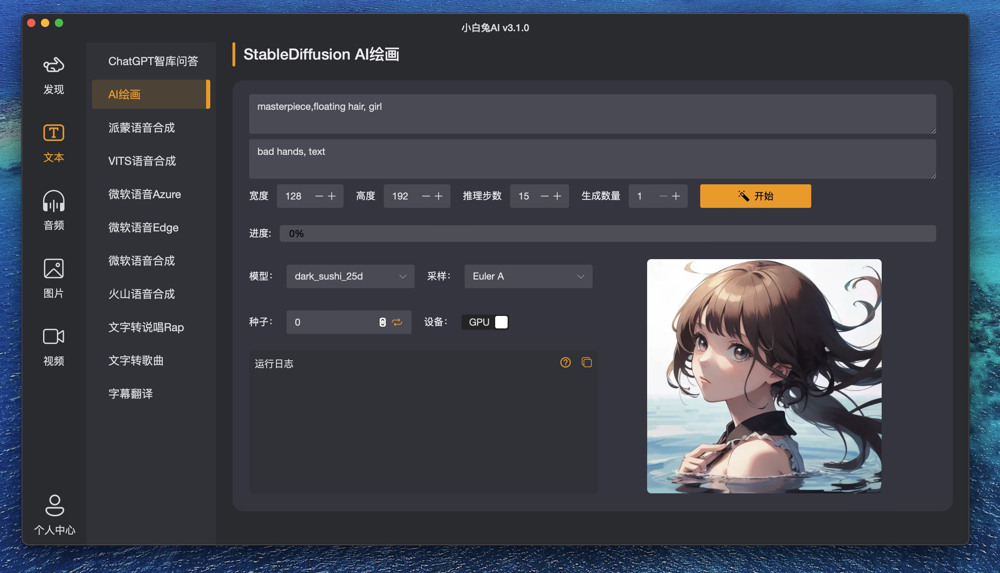
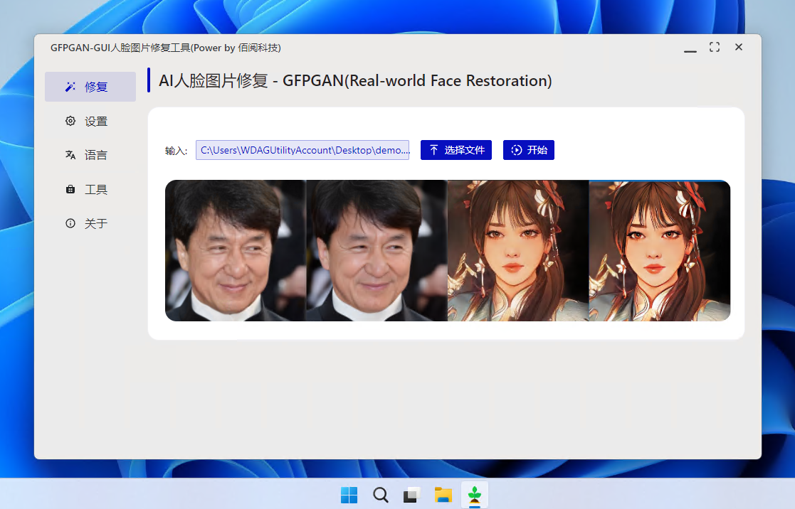
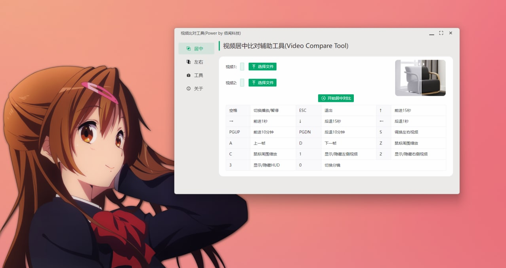
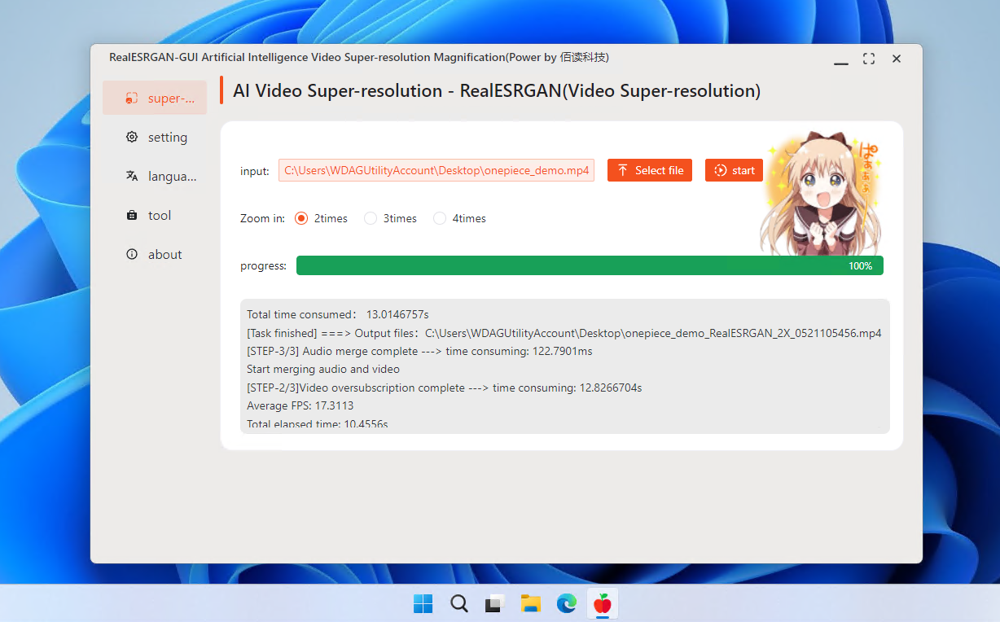
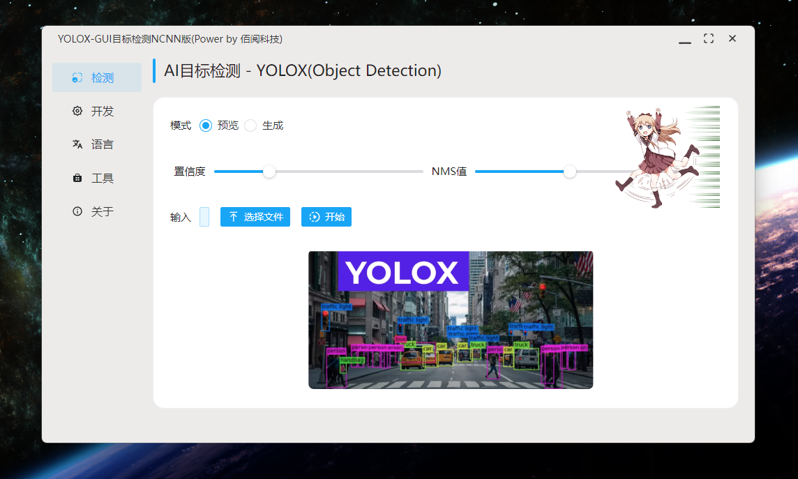
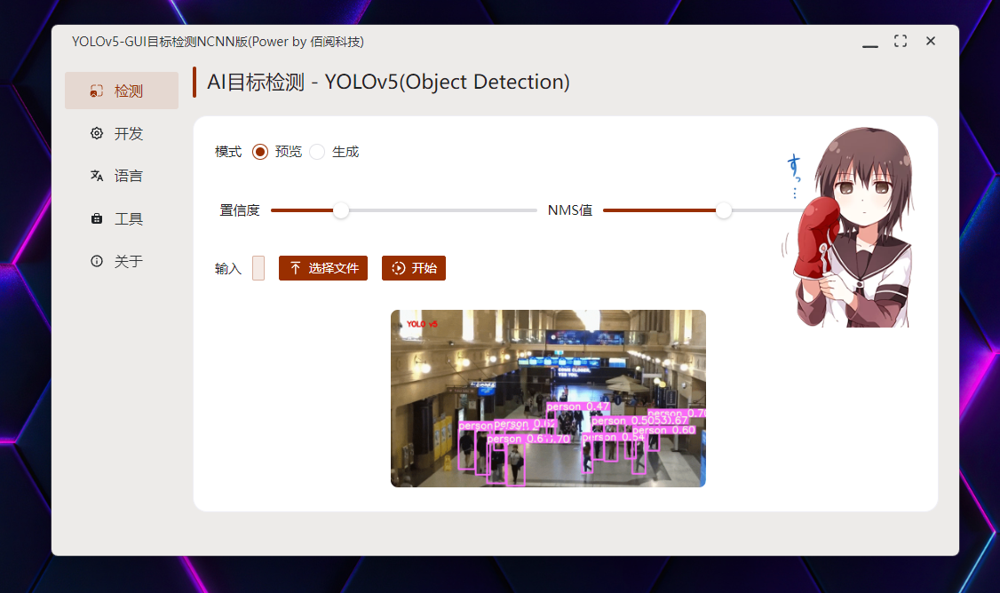

##  
 Paper2GUI 🚀🚀🌟: 让每个人都简单方便的使用前沿人工智能技术 

Paper2GUI: 一款面向普通人的AI桌面APP工具箱，免安装即开即用，已支持20+AI模型，内容涵盖语音合成、视频补帧、视频超分、目标检测、图片风格化、OCR识别等领域。支持Windows、Mac、Linux系统。

<a href="README_en.md">English</a> | 中文 | <a href="https://t.me/baiyueblog">Telegram</a> | <a href="https://www.bilibili.com/video/BV1jY411u7yU">B站(媒体)</a>

> 为了持久发展，我们将现有的优秀AI模型进行了统一融合，Paper2GUI 现在有了一个中文名“小白兔AI”。

下载地址：[Download](https://github.com/Baiyuetribe/paper2gui/releases/download/Published/AI-amd64-installer_2_4_0.exe)

### 已发布内容【下列独立APP完全免费】

- [语音合成](Text2Speech/readme.md)
  
> 文字转语音工具，适用于配音、讲解、说书、广告等场景。

| 名称                                          | 大小 | Model      | 多语言 | Windows | Mac | Linux | 下载                                                                        |
| --------------------------------------------- | ---- | ---------- | ------ | ------- | --- | ----- | --------------------------------------------------------------------------- |
| [微软语音合成🔥](Text2Speech/microsoft_tts.md) | 5Mb  | FastSpeech | ✅      | ✅       | ✅   | ✅     | [Download](https://github.com/Baiyuetribe/paper2gui/releases/tag/Published) |
| [抖音火山语音🔥](Text2Speech/huoshan_tts.md)   | 13Mb | Unknown    | 🔲      | ✅       | ✅   | ✅     | [Download](https://github.com/Baiyuetribe/paper2gui/releases/tag/Published) |
| [阿里云语音合成](Text2Speech/aliyun_tts.md)   | 13Mb | Unknown    | 🔲      | ✅       | ✅   | ✅     | [Download](https://github.com/Baiyuetribe/paper2gui/releases/tag/Published) |

- [艺术绘画](StableDiffusion/readme.md)
  
> 文本转图片，想象力与AI的完美结合

| 名称                                          | 大小 | Model | 多语言 | Windows | Mac | Linux | 下载                                                                        |
| --------------------------------------------- | ---- | ----- | ------ | ------- | --- | ----- | --------------------------------------------------------------------------- |
| [StableDiffusion🔥](StableDiffusion/readme.md) | 10Mb | Naifu | ✅      | ✅       | 🔲   | 🔲     | [Download](https://github.com/Baiyuetribe/paper2gui/releases/tag/Published) |

- [视频超分辨放大](Video%20Super%20Resolution/readme.md)

> 视频超分工具，适用于720p或360p视频转1080p或4k视频,画质升级且不模糊，目前主要用于动漫视频超分。
  
| 名称                                                                     | 大小   | Model        | 多语言 | Windows | Mac | Linux | 下载                                                                        |
| ------------------------------------------------------------------------ | ------ | ------------ | ------ | ------- | --- | ----- | --------------------------------------------------------------------------- |
| [RealESRGAN-GUI(RAM)🔥](Video%20Super%20Resolution/RealESRGAN-GUI-RAM.md) | 41.8Mb | RealESRGANv3 | ✅      | ✅       | 🔲   | 🔲     | [Download](https://github.com/Baiyuetribe/paper2gui/releases/tag/Published) |
| [waifu2x-GUI](Video%20Super%20Resolution/waifu2x-gui.md)                 | 38.9Mb | waifu2x      | ⏳      | ✅       | 🔲   | 🔲     | [Download](https://github.com/Baiyuetribe/paper2gui/releases/tag/Published) |
| [RealESRGAN-GUI](Video%20Super%20Resolution/RealESRGAN-GUI.md)           | 28.8Mb | RealESRGANv2 | 🔲      | ✅       | 🔲   | 🔲     | [Download](https://github.com/Baiyuetribe/paper2gui/releases/tag/Published) |
| [RealCugan-GUI](Video%20Super%20Resolution/RealCugan-GUI.md)             | 56.4Mb | RealCugan    | 🔲      | ✅       | 🔲   | 🔲     | [Download](https://github.com/Baiyuetribe/paper2gui/releases/tag/Published) |
| [RealSR-GUI](Video%20Super%20Resolution/RealSR-GUI.md)                   | 94.5Mb | RealSR       | 🔲      | ✅       | 🔲   | 🔲     | [Download](https://github.com/Baiyuetribe/paper2gui/releases/tag/Published) |

- [视频补帧](Video%20Frame%20Interpolation/readme.md)

> 运动类视频流畅度升级工具，可以将低帧率30fps升级到60fps或360fps。适用于丝滑质感需求。

| 名称                                                        | 大小   | Model | 多语言 | Windows | Mac | Linux | 下载                                                                        |
| ----------------------------------------------------------- | ------ | ----- | ------ | ------- | --- | ----- | --------------------------------------------------------------------------- |
| [RIFE-GUI(RAM)🔥](Video%20Frame%20Interpolation/rife-gui.md) | 51.2Mb | Rife  | ✅      | ✅       | 🔲   | 🔲     | [Download](https://github.com/Baiyuetribe/paper2gui/releases/tag/Published) |
| [DAIN-GUI](Video%20Frame%20Interpolation/dain-gui.md)       | 72.6Mb | Dain  | 🔲      | ✅       | 🔲   | 🔲     | [Download](https://github.com/Baiyuetribe/paper2gui/releases/tag/Published) |

- [图像风格化(照片转动漫)](Style%20Transfer/readme.md)

> 图像风格化，可以将照片转换为动漫风格、梵高风格、毕加索风格等等。

| 名称                                              | 大小  | Model      | 多语言 | Windows | Mac | Linux | 下载                                                                        |
| ------------------------------------------------- | ----- | ---------- | ------ | ------- | --- | ----- | --------------------------------------------------------------------------- |
| [AnimeGAN-GUI🔥](Style%20Transfer/animegan_gui.md) | 8.9Mb | AnimeGANv2 | ✅      | ✅       | 🔲   | 🔲     | [Download](https://github.com/Baiyuetribe/paper2gui/releases/tag/Published) |

- [人像抠图](ImageMatting/readme.md)

> AI一键抠图，可生成透明图、绿幕、红幕、蓝幕等背景图片，头发丝处理良好，适合任意人物抠图需求。

| 名称                                | 大小   | Model | 多语言 | Windows | Mac | Linux | 下载                                                                        |
| ----------------------------------- | ------ | ----- | ------ | ------- | --- | ----- | --------------------------------------------------------------------------- |
| [RVM-GUI🔥](ImageMatting/rvm_gui.md) | 12.9Mb | rvm   | 🔲      | ✅       | 🔲   | 🔲     | [Download](https://github.com/Baiyuetribe/paper2gui/releases/tag/Published) |

- [人像修复](FaceRestoration/readme.md)

> 人像修复，可以将人像修复为清晰的图片，提升清晰度。

| 名称                                     | 大小  | Model  | 多语言 | Windows | Mac | Linux | 下载                                                                        |
| ---------------------------------------- | ----- | ------ | ------ | ------- | --- | ----- | --------------------------------------------------------------------------- |
| [GFPGAN-GUI🔥](FaceRestoration/readme.md) | 242Mb | GFPGAN | ✅      | ✅       | 🔲   | 🔲     | [Download](https://github.com/Baiyuetribe/paper2gui/releases/tag/Published) |

- [视频抠图](VideoMatting/readme.md)

> 视频抠图，利用RVM等算法，可实现无绿幕视频抠图，适合各种自媒体视频制作，节约大量时间。

| 名称                                           | 大小   | Model       | 多语言 | Windows | Mac | Linux | 下载                                                                        |
| ---------------------------------------------- | ------ | ----------- | ------ | ------- | --- | ----- | --------------------------------------------------------------------------- |
| [MODNet-GUI🔥](VideoMatting/modnet_gui.md)      | 77.5Mb | modnet      | 🔲      | ✅       | 🔲   | 🔲     | [Download](https://github.com/Baiyuetribe/paper2gui/releases/tag/Published) |
| [MobileNetV2-GUI🔥](VideoMatting/modnet_gui.md) | 34.6Mb | MobileNetV2 | 🔲      | ✅       | 🔲   | 🔲     | [Download](https://github.com/Baiyuetribe/paper2gui/releases/tag/Published) |

- [目标检测](Object%20Detection/readme.md)

> 适用范围太广，比如物体检测、口罩检测、车牌检测、车辆检测、苹果质量等级检测等等。

| 名称                                           | 大小   | Model      | 多语言 | Windows | Mac | Linux | 下载                                                                        |
| ---------------------------------------------- | ------ | ---------- | ------ | ------- | --- | ----- | --------------------------------------------------------------------------- |
| [YOLOv6-GUI](Object%20Detection/yolov6_gui.md) | 46Mb   | yolov6n    | ✅      | ✅       | 🔲   | 🔲     | [Download](https://github.com/Baiyuetribe/paper2gui/releases/tag/Published) |
| [YOLOv5-GUI](Object%20Detection/yolov5_gui.md) | 60.2Mb | yolov5s    | ✅      | ✅       | 🔲   | 🔲     | [Download](https://github.com/Baiyuetribe/paper2gui/releases/tag/Published) |
| [YOLOX-GUI](Object%20Detection/yolox_gui.md)   | 50Mb   | yolox_nano | ✅      | ✅       | 🔲   | 🔲     | [Download](https://github.com/Baiyuetribe/paper2gui/releases/tag/Published) |

- [辅助工具](Auxiliary_tools/readme.md)

> 辅助工具，提供了一些常用的辅助工具，比如视频比对工具等。

| 名称                                        | 大小   | Model | 多语言 | Windows | Mac | Linux | 下载                                                                        |
| ------------------------------------------- | ------ | ----- | ------ | ------- | --- | ----- | --------------------------------------------------------------------------- |
| [Video_compare🔥](Auxiliary_tools/readme.md) | 56.1Mb |       |        | ✅       | 🔲   | 🔲     | [Download](https://github.com/Baiyuetribe/paper2gui/releases/tag/Published) |

- [小白兔AI - 聚合版【更专业的选择】](https://xiaobaituai.com)

> 小白兔AI 是一款功能非常强大的人工智能软件,实现了语音合成、视频抠图、动漫超分辨、视频补帧、录音降噪、视频上色、人脸动漫化、图片OCR批量识别等30余种功能，致力于打造一款实用、好玩又有趣的AI生产力聚合工具箱。面向专业用户，可免费试用14天。

| 已内置功能              | 适用场景                   | 功能简介                                                                                        |
| ----------------------- | -------------------------- | ----------------------------------------------------------------------------------------------- |
| RealCugan-Pro动漫超分辨 | 动漫图片或视频超分辨放大   | 自研AI引擎驱动，可获得最高质量的动漫超分辨效果，可能是目前唯一可轻松使用RealCugan-Pro模型的软件 |
| RealESRGAN动漫超分辨    | 动漫图片或视频             | 推理速度快，质量比waifu2x好太多，常规超分辨首选                                                 |
| 智能抠图                | 任意图片或视频             | 推理速度快，一键获得透明图片或绿幕视，进行二次创作                                              |
| 人像动漫化              | 仅适合头像处理             | 转换效果出众，有趣又好玩                                                                        |
| 语音合成                | 自媒体视频配音、有声读书等 | 效果逼近真人，发音自然、带呼吸声、支持txt大文件极速合成                                         |
| 录音降噪                | 真人配音后处理             | 一键去除环境和背景噪音，提升录音清晰度，效果明显                                                |
| 视频补帧                | 运动类视频流畅度升级工具   | 可获得丝滑观感，已支持RIFE和IFRNET两种AI模型                                                    |
| 一键超补                | 同时完成超分和补帧         | 融合超分和补帧模型，一键获得超补结果                                                            |
| AI一键跑分              | 一键查看设备AI性能数据     | 模拟真实推理任务，统一量化推理任务，耗时越小越好                                                |
| 图片OCR识别             | 图片转文字                 | 基于Paddle-OCR-v3模型，迄今最优秀的OCR识别模型、效果出众                                        |
| 视频字幕OCR提取         | 硬字幕提取                 | 使用PP-OCR自动识别字幕位置及文字，输出字幕文件                                                  |
| 视频上色                | 老旧黑白照片或视频上色     | 适合风景类黑白视频上色，推理速度快                                                              |
| 人脸修复                | 人脸照片修复               | 可增强老旧照片、修复人脸，提高清晰度                                                            |
| 目标检测                | 图像检测和分割             | 展示AI技术在通用场景下的检测、分割、追踪等效果                                                  |

> 聚合版面向专业需求用户，付费只是为了做的更好更专业。功能持续添加中，已开源的20个单独APP完全免费，各取所需，请勿喷我，如果项目帮到了你，不妨点个Star。

### 部分截图

### 适配说明

本人开发环境为`Windows`系统，默认会发布`Windows`和`Linux`版本，得益于微软`Sandbox`和`WSL2`，可随时测试这些环境。Mac版需要主动参与反馈。为了拓展和持续产出优质又实用的AI生产力工具，现已上架“小白兔AI”，欢迎大家助力开发者，推动人工智能的普及化。

### 社群交流

QQ群：497556961

### 变更日志

[查看](docs/CHANGELOG.md)

### 参考

- [webview/webview](https://github.com/webview/webview)
- [Tencent/ncnn](https://github.com/Tencent/ncnn)
- [FFmpeg/FFmpeg](https://github.com/FFmpeg/FFmpeg)
- [wailsapp/wails](https://github.com/wailsapp/wails)
- [xinntao/Real-ESRGAN](https://github.com/xinntao/Real-ESRGAN)
- [nihui/waifu2x-ncnn-vulkan](https://github.com/nihui/waifu2x-ncnn-vulkan)
- [nihui/realcugan-ncnn-vulkan](https://github.com/nihui/realcugan-ncnn-vulkan)
- [nihui/rife-ncnn-vulkan](https://github.com/nihui/rife-ncnn-vulkan)
- [RealESRGAN](https://github.com/xinntao/Real-ESRGAN/)
- [TuSimple/naive-ui](https://github.com/TuSimple/naive-ui)
- [vitejs/vite](https://github.com/vitejs/vite)
- [Baiyuetribe/ncnn-models](https://github.com/Baiyuetribe/ncnn-models)
  
### Star History

