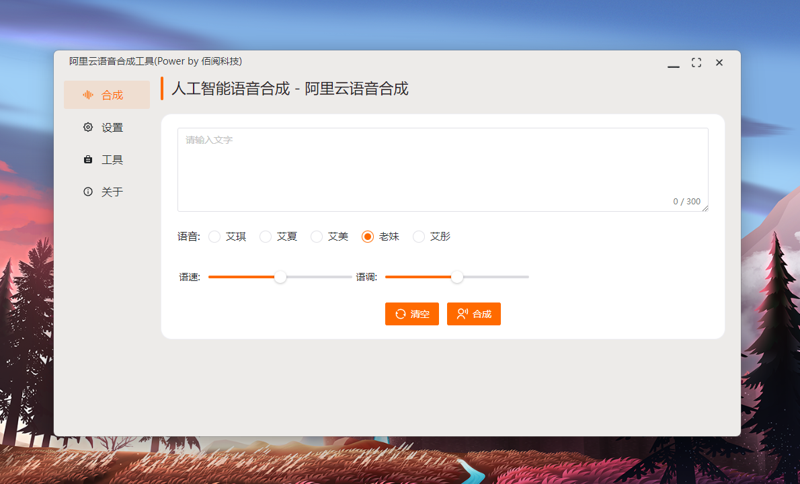

##  
 Paper2GUI 🚀🚀🌟: 让每个人都简单方便的使用前沿人工智能技术 

Paper2GUI: 一款面向普通人的AI桌面APP工具箱，免安装即开即用，已支持10+AI模型，内容涵盖语音合成、视频补帧、视频超分、目标检测、图片风格化、图片OCR识别等领域。支持Windows、Mac、Linux系统。让每个人都简单方便的使用前沿人工智能技术。

<a href="README_en.md">English</a> | 中文 | <a href="https://t.me/baiyueblog">Telegram</a>

- [语音合成](Text2Speech/readme.md)

| 名称           | 大小 | Model      | 多语言 | Windows | Mac | Linux | 下载                                                                                                                        |
| -------------- | ---- | ---------- | ------ | ------- | --- | ----- | --------------------------------------------------------------------------------------------------------------------------- |
| 微软语音合成   | 5Mb  | FastSpeech | ✅      | ✅       | ✅   | ✅     | [Github](https://github.com/Baiyuetribe/paper2gui/releases/tag/Published) [云盘](https://www.aliyundrive.com/s/2b4hyudGkni) |
| 抖音火山语音   | 13Mb | Unkonw     | 🔲      | ✅       | ✅   | ✅     | [Github](https://github.com/Baiyuetribe/paper2gui/releases/tag/Published) [云盘](https://www.aliyundrive.com/s/2b4hyudGkni) |
| 阿里云语音合成 | 13Mb | Unkonw     | 🔲      | ✅       | ✅   | ✅     | [Github](https://github.com/Baiyuetribe/paper2gui/releases/tag/Published) [云盘](https://www.aliyundrive.com/s/2b4hyudGkni) |
|                |      |            |        |         |     |       |                                                                                                                             |
|                |      |            |        |         |     |       |                                                                                                                             |  |

- [视频超分辨放大](Video%20Super%20Resolution/readme.md)
  
| 名称             | 大小   | Model        | 多语言 | Windows | Mac | Linux | 下载                                                                                                                        |
| ---------------- | ------ | ------------ | ------ | ------- | --- | ----- | --------------------------------------------------------------------------------------------------------------------------- |
| waifu2x-GUI      | 38.9Mb | waifu2x      | 🔲      | ✅       | 🔲   | 🔲     | [Github](https://github.com/Baiyuetribe/paper2gui/releases/tag/Published) [云盘](https://www.aliyundrive.com/s/2b4hyudGkni) |
| RealESRGANv2-GUI | 29Mb   | RealESRGANv2 | 🔲      | ✅       | 🔲   | 🔲     | [Github](https://github.com/Baiyuetribe/paper2gui/releases/tag/Published) [云盘](https://www.aliyundrive.com/s/2b4hyudGkni) |
| RealCugan-GUI    | 56.4Mb | RealCugan    | 🔲      | ✅       | 🔲   | 🔲     | [Github](https://github.com/Baiyuetribe/paper2gui/releases/tag/Published) [云盘](https://www.aliyundrive.com/s/2b4hyudGkni) |
| RealSR-GUI       | 94.5Mb | RealSR       | 🔲      | ✅       | 🔲   | 🔲     | [Github](https://github.com/Baiyuetribe/paper2gui/releases/tag/Published) [云盘](https://www.aliyundrive.com/s/2b4hyudGkni) |
|                  |        |              |        |         |     |       |                                                                                                                             |
|                  |        |              |        |         |     |       |

- [视频补帧](Video%20Frame%20Interpolation/readme.md)
  
| 名称     | 大小   | Model | 多语言 | Windows | Mac | Linux | 下载                                                                                                                        |
| -------- | ------ | ----- | ------ | ------- | --- | ----- | --------------------------------------------------------------------------------------------------------------------------- |
| RIFE-GUI | 37.9Mb | Rife  | 🔲      | ✅       | 🔲   | 🔲     | [Github](https://github.com/Baiyuetribe/paper2gui/releases/tag/Published) [云盘](https://www.aliyundrive.com/s/2b4hyudGkni) |
| DAIN-GUI | 72.6Mb | Dain  | 🔲      | ✅       | 🔲   | 🔲     | [Github](https://github.com/Baiyuetribe/paper2gui/releases/tag/Published) [云盘](https://www.aliyundrive.com/s/2b4hyudGkni) |
|          |        |       |        |         |     |       |                                                                                                                             |
|          |        |       |        |         |     |       |                                                                                                                             |

- [图像风格化(照片转动漫)](Style%20Transfer/readme.md)

| 名称         | 大小  | Model      | 多语言 | Windows | Mac | Linux | 下载                                                     |
| ------------ | ----- | ---------- | ------ | ------- | --- | ----- | -------------------------------------------------------- |
| AnimeGAN-GUI | 8.9Mb | AnimeGANv2 | ✅      | ✅       | 🔲   | 🔲     | [AnimeGAN-GUI](https://github.com/Baiyuetribe/paper2gui) |
|              |       |            |        |         |     |       |                                                          |
|              |       |            |        |         |     |       |                                                          |  |

- [目标检测](Object%20Detection/readme.md)

| 名称      | 大小 | Model | 多语言 | Windows | Mac | Linux | 下载                                                  |
| --------- | ---- | ----- | ------ | ------- | --- | ----- | ----------------------------------------------------- |
| Yolo2-GUI |      | yolo2 | ✅      | ✅       | 🔲   | 🔲     | [Yolo2-GUI](https://github.com/Baiyuetribe/paper2gui) |
|           |      |       |        |         |     |       |                                                       |
|           |      |       |        |         |     |       |                                                       |  |

- 部分截图

## 参考

- [webview/webview](https://github.com/webview/webview)
- [Tencent/ncnn](https://github.com/Tencent/ncnn)
- [FFmpeg/FFmpeg](https://github.com/FFmpeg/FFmpeg)
- [wailsapp/wails](https://github.com/wailsapp/wails)
- [nihui/waifu2x-ncnn-vulkan](https://github.com/nihui/waifu2x-ncnn-vulkan)
- [nihui/realcugan-ncnn-vulkan](https://github.com/nihui/realcugan-ncnn-vulkan)
- [nihui/rife-ncnn-vulkan](https://github.com/nihui/rife-ncnn-vulkan)
- [nihui/realsr-ncnn-vulkan](https://github.com/nihui/realsr-ncnn-vulkan)
- [RealESRGAN](https://github.com/xinntao/Real-ESRGAN/)
- [TuSimple/naive-ui](https://github.com/TuSimple/naive-ui)
- [vitejs/vite](https://github.com/vitejs/vite)