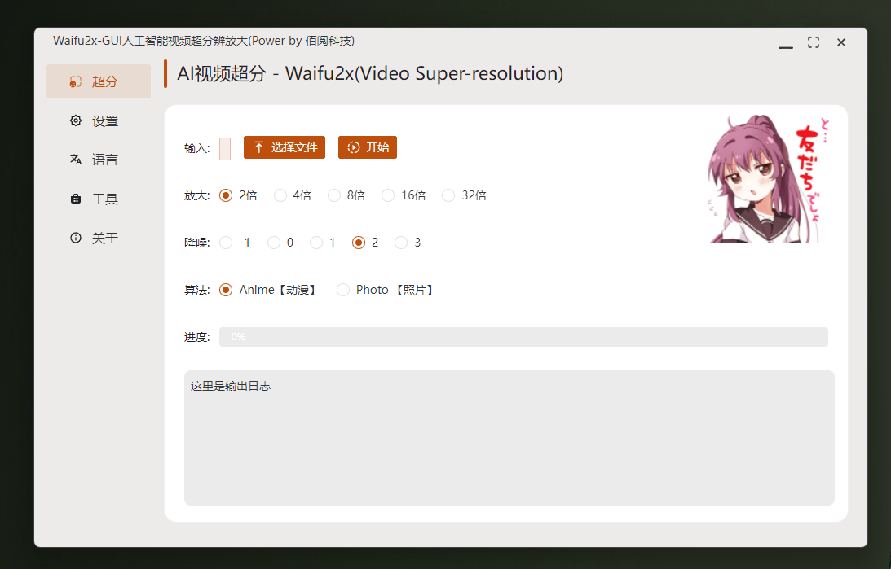

##  
 Paper2GUI 🚀🚀🌟: Make it easy and convenient for everyone to use cutting-edge artificial intelligence technology 

English | <a href="README_zh.md">中文</a> | <a href="https://t.me/baiyueblog">Telegram</a>

- Text to Speech

| Name         | Size  | Model      | Multi-language | Windows | Mac | Linux | Download                                                                                                                    |
| ------------ | ----- | ---------- | -------------- | ------- | --- | ----- | --------------------------------------------------------------------------------------------------------------------------- |
| 微软神经网络 | 3.6Mb | FastSpeech | ✅              | ✅       | ✅   | ✅     | [Github](https://github.com/Baiyuetribe/paper2gui/releases/tag/Published) [云盘](https://www.aliyundrive.com/s/2b4hyudGkni) |
| 抖音火山语音 | 13Mb  | Unkonw     | 🔲              | ✅       | ✅   | ✅     | [Github](https://github.com/Baiyuetribe/paper2gui/releases/tag/Published) [云盘](https://www.aliyundrive.com/s/2b4hyudGkni) |
|              |       |            |                |         |     |       |                                                                                                                             |
|              |       |            |                |         |     |       |                                                                                                                             |

- Video Super Resolution
  
| Name             | Size   | Model        | Multi-language | Windows | Mac | Linux | Download                                                                                                                    |
| ---------------- | ------ | ------------ | -------------- | ------- | --- | ----- | --------------------------------------------------------------------------------------------------------------------------- |
| waifu2x-GUI      | 38.9Mb | waifu2x      | 🔲              | ✅       | 🔲   | 🔲     | [Github](https://github.com/Baiyuetribe/paper2gui/releases/tag/Published) [云盘](https://www.aliyundrive.com/s/2b4hyudGkni) |
| RealESRGANv2-GUI | 29Mb   | RealESRGANv2 | 🔲              | ✅       | 🔲   | 🔲     | [Github](https://github.com/Baiyuetribe/paper2gui/releases/tag/Published) [云盘](https://www.aliyundrive.com/s/2b4hyudGkni) |
| RealCugan-GUI    | 56.4Mb | RealCugan    | 🔲              | ✅       | 🔲   | 🔲     | [Github](https://github.com/Baiyuetribe/paper2gui/releases/tag/Published) [云盘](https://www.aliyundrive.com/s/2b4hyudGkni) |
| RealSR-GUI       | 94.5Mb | RealSR       | 🔲              | ✅       | 🔲   | 🔲     | [Github](https://github.com/Baiyuetribe/paper2gui/releases/tag/Published) [云盘](https://www.aliyundrive.com/s/2b4hyudGkni) |
|                  |        |              |                |         |     |       |                                                                                                                             |
|                  |        |              |                |         |     |       |

- Video Frame Interpolation
  
| Name     | Size   | Model | Multi-language | Windows | Mac | Linux | Download                                                                                                                    |
| -------- | ------ | ----- | -------------- | ------- | --- | ----- | --------------------------------------------------------------------------------------------------------------------------- |
| RIFE-GUI | 37.9Mb | Rife  | 🔲              | ✅       | 🔲   | 🔲     | [Github](https://github.com/Baiyuetribe/paper2gui/releases/tag/Published) [云盘](https://www.aliyundrive.com/s/2b4hyudGkni) |
| DAIN-GUI | 72.6Mb | Dain  | 🔲              | ✅       | 🔲   | 🔲     | [Github](https://github.com/Baiyuetribe/paper2gui/releases/tag/Published) [云盘](https://www.aliyundrive.com/s/2b4hyudGkni) |
|          |        |       |                |         |     |       |                                                                                                                             |
|          |        |       |                |         |     |       |                                                                                                                             |
- Object Detectio

| Name      | Size | Model | Multi-language | Windows | Mac | Linux | Download                                              |
| --------- | ---- | ----- | -------------- | ------- | --- | ----- | ----------------------------------------------------- |
| Yolo2-GUI |      | yolo2 | ✅              | ✅       | 🔲   | 🔲     | [Yolo2-GUI](https://github.com/Baiyuetribe/paper2gui) |
|           |      |       |                |         |     |       |                                                       |
|           |      |       |                |         |     |       |                                                       |

- Screenshot

