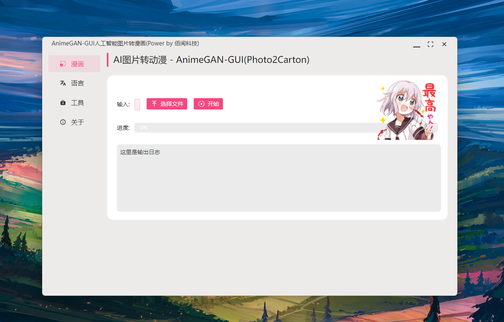

# AmineGAN-GUI图片转漫画工具

【快捷入口：[综述](readme.md) # [AnimeGAN](animegan_gui.md)】

## 软件截图

## 软件特点：

- 操作简单、即开即用
- 支持Windows (Mac和Linux以后完善)
- 软件比较小，轻量便捷
- 支持多种界面语言显示
  
## 效果展示：

## 使用须知：

图片尽量为正方形矩形图片，animeganv2版输出为512*512，虽然AnimeganV3已发布，但是从pt模型转onnx,再从onnx转换成ncnn需要技巧，如有会转的，可以提个pr.

## 下载地址：

方式1：[GitHub](https://github.com/Baiyuetribe/paper2gui/releases/tag/Published)
方式2：[阿里云盘](https://www.aliyundrive.com/s/2b4hyudGkni)

## 使用反馈：

请前往：https://github.com/Baiyuetribe/paper2gui/issues

## 相关资料：

- [animegan2-pytorch](https://github.com/bryandlee/animegan2-pytorch)
- [Naive-ui](https://www.naiveui.com/zh-CN/os-theme)
- [wailsapp/wails](https://github.com/wailsapp/wails)
- [Baiyuetribe/paper2gui](https://github.com/Baiyuetribe/paper2gui)