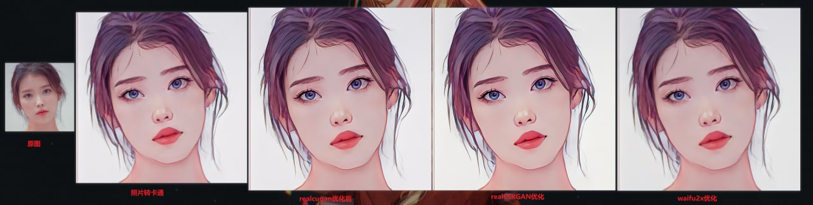

# Styletransfer(photo2Carton)

【QuickOverview：[Overview](readme.md) # [AnimeGAN](animegan_gui.md) # [中文] (readme.md)】
## Developer Comments:
> As of April 2022, the stylization of AI graphics is even more extreme, some are very abstract and artistic, bringing out the aesthetic polarization. For example, the oil painting style, if the super-resolution was enlarged and made into a physical object to see it's definitely a work of art. However, if the comparison is reduced, it is another work of art on its own.
## Brief Overview:
Graphic stylization open source projects are not popular, so it has integrated picture to animation tools, and more graphic styling tools may be integrated in the future.

## Creative PK:

- How do I generate a dynamic video between the original image and the generated anime image? The frame-fill algorithm seems to be able to do it!

## References:

- [Naive-ui](https://www.naiveui.com/zh-CN/os-theme)
- [wailsapp/wails](https://github.com/wailsapp/wails)
- [Baiyuetribe/paper2gui](https://github.com/Baiyuetribe/paper2gui)