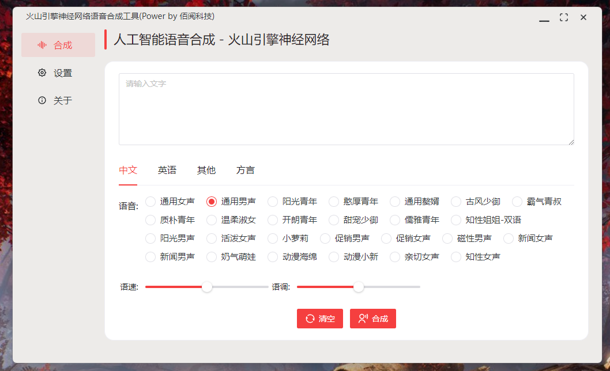

# 抖音火山语音合成工具

【快捷入口：[综述](readme.md) # [微软语音](microsoft_tts.md) # [火山语音](huoshan_tts.md) # [阿里云语音](aliyun_tts.md)】

## 软件截图

## 软件特点

- 操作简单、即开即用
- 支持音效试听
- 支持无限多开
- 中文语音丰富、自带呼吸声，效果逼真
- 支持Windows、Mac、Linux三端
- 软件比较小，轻量便捷
  
## 付费须知

请前往[火山引擎](https://www.volcengine.com/product/voice-tech)咨询客服，付费开通后填入对应的参数即可使用。

## 下载地址：

方式1：[GitHub](https://github.com/Baiyuetribe/paper2gui/releases/tag/Published)
方式2：[阿里云盘](https://www.aliyundrive.com/s/2b4hyudGkni)

## 使用反馈：

请前往：https://github.com/Baiyuetribe/paper2gui/issues

## 相关资料：

- [火山nls](https://www.volcengine.com/product/voice-tech)
- [Naive-ui](https://www.naiveui.com/zh-CN/os-theme)
- [wailsapp/wails](https://github.com/wailsapp/wails)
- [Baiyuetribe/paper2gui](https://github.com/Baiyuetribe/paper2gui)