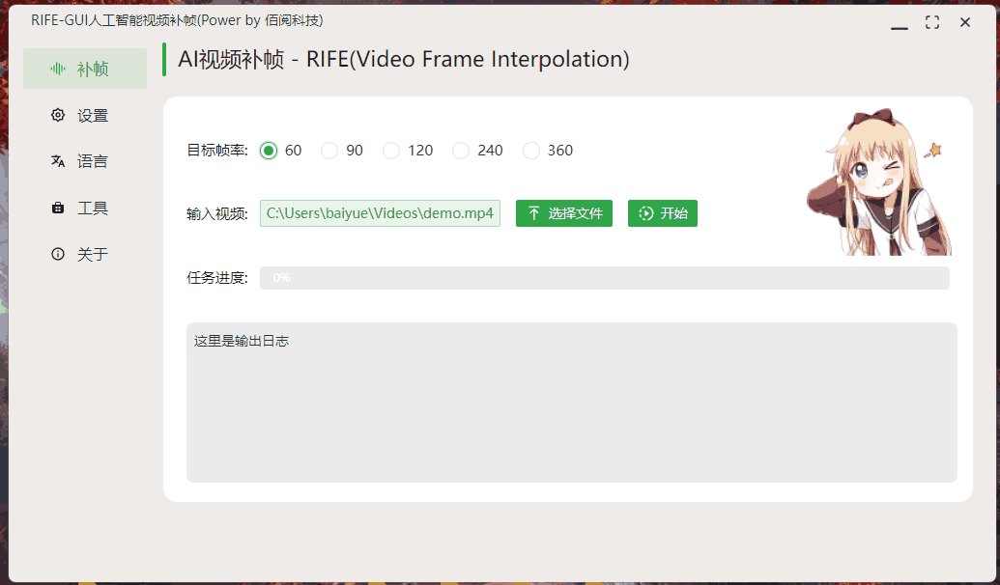

# Rife-GUI(RAM)人工智能视频补帧

【快捷入口：[综述](readme.md) # [Rife](rife-gui.md) # [DAIN](dain-gui.md)】

## 软件截图

## 软件特点

- 内存模式，不消耗硬盘空间，比旧版提速30%以上
- 操作简单、即开即用
- 截至目前补帧速度最快的算法
- 支持Windows(Mac、Linux后续补全)
- 软件比较小，轻量便捷
- 支持多语言
- 理论支持无限超分，内置帧率放大2/3/4倍
- 支持vulkan GPU加速，低显存消耗

## 效果演示：

| 原始低帧率                       | 补帧后                           |
| -------------------------------- | -------------------------------- |
|  |  |

## 使用场景：

B站动漫超分补帧，24fps转60fps，实现丝滑画质。

## 下载地址：

`该功能在小白兔AI 3.0版起永久免费开放，欢迎使用`
方式1：[GitHub](https://github.com/Baiyuetribe/paper2gui/releases/tag/Published)
方式2：[阿里云盘](https://www.aliyundrive.com/s/2b4hyudGkni)

## 使用反馈：

请前往：https://github.com/Baiyuetribe/paper2gui/issues

## 相关资料：

- [hzwer/arXiv2021-RIFE](https://github.com/hzwer/arXiv2021-RIFE)
- [nihui/rife-ncnn-vulkan](https://github.com/nihui/rife-ncnn-vulkan)
- [Tencent/ncnn](https://github.com/Tencent/ncnn)
- [Naive-ui](https://www.naiveui.com/zh-CN/os-theme)
- [wailsapp/wails](https://github.com/wailsapp/wails)
- [Baiyuetribe/paper2gui](https://github.com/Baiyuetribe/paper2gui)