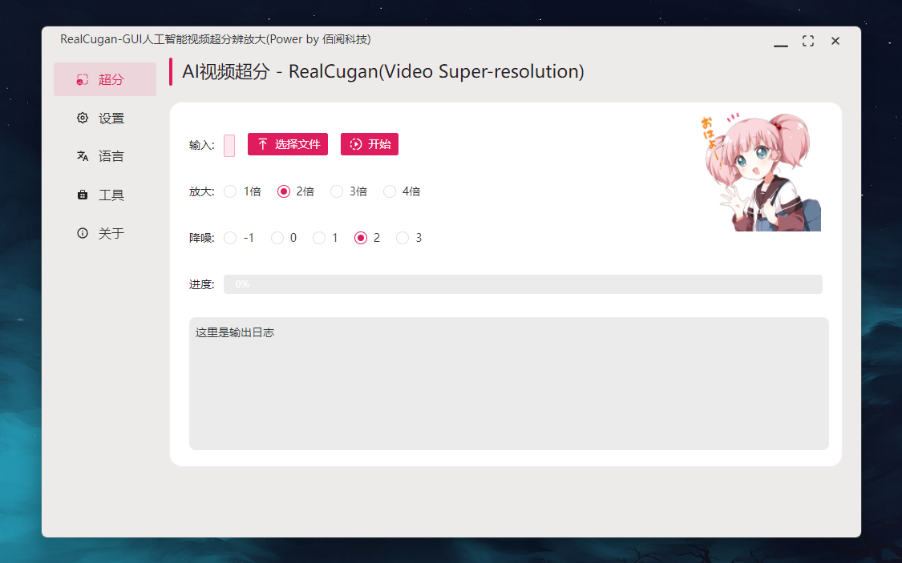

# RealCugan-GUI 动漫视频超分工具

【快捷入口：[综述](readme.md) # [RealCugan](RealCugan-GUI.md) # [RealESRGAN](RealESRGAN-GUI.md) # [Waifu2x](waifu2x-gui.md) # [ReslSR](RealSR-GUI.md)】

## 软件截图：

## 效果演示：

## 软件特点

- 操作简单、即开即用
- 支持放大2倍、3倍、4倍
- 特别适合动漫处理
- 支持降噪处理-1~3
- 支持单张图片或视频放大
- 软件体积小，轻量便捷
- 支持vulkan GPU加速，低显存消耗
- 支持Windows(Mac、Linux后续补全)

## 使用场景：

- B站实验室开发，动漫处理优秀，比waifu2x速度慢，但是质量高

## 案例展示

<https://user-images.githubusercontent.com/61866546/147812864-52fdde74-602f-4f64-ac05-4d34cc58aa79.mp4>

### 视频处理

| 测试信息 | 内容                                      |
| -------- | ----------------------------------------- |
| 系统     | Windows 11                                |
| 处理器   | Intel(R) Core(TM) i9-10900K CPU @ 3.70GHz |
| 显卡     | NVIDIA GeForce RTX 2070 SUPER             |
| RAM      | 32.0 GB                                   |

源文件： 任务：放大2倍

<https://cdn.jsdelivr.net/gh/Baiyuetribe/paper2gui@main/docs/video/vsr/onepiece_demo.mp4>

实际效果：

<https://raw.githubusercontent.com/Baiyuetribe/paper2gui/main/docs/video/vsr/onepiece_demo_realcugan_2X_0429181825.mp4>

## 模型备注

<table>
	<tr>
	    <th align="center"></th>
        <th align="center">1倍</th>
	    <th align="center">2倍</th>
	    <th align="center">3倍/4倍</th>  
	</tr >
	<tr>
	    <td align="center" >降噪程度</td>
	    <td align="center">仅支持无降噪，训练中</td>
	    <td align="center">现支持无降噪/1x/2x/3x</td>
        <td align="center">现支持无降噪/3x，1x/2x训练中</td>
	</tr>
	<tr>
	    <td  align="center">保守模型</td>
	    <td  align="center">训练中</td>
	    <td  colspan="2" align="center">已支持</td>
	</tr>
	<tr>
        <td  align="center">快速模型</td>
	    <td  colspan="3" align="center">调研中</td>
	</tr>
</table>

## 下载地址：

方式1：[GitHub](https://github.com/Baiyuetribe/paper2gui/releases/tag/Published)
方式2：[阿里云盘](https://www.aliyundrive.com/s/2b4hyudGkni)

## 使用反馈：

请前往：https://github.com/Baiyuetribe/paper2gui/issues

## 参考

- [bilibili/ailab](https://github.com/bilibili/ailab/edit/main/Real-CUGAN)
- [nihui/realcugan-ncnn-vulkan](https://github.com/nihui/realcugan-ncnn-vulkan)
- [Naive-ui](https://www.naiveui.com/zh-CN/os-theme)
- [wailsapp/wails](https://github.com/wailsapp/wails)
- [Baiyuetribe/paper2gui](https://github.com/Baiyuetribe/paper2gui)