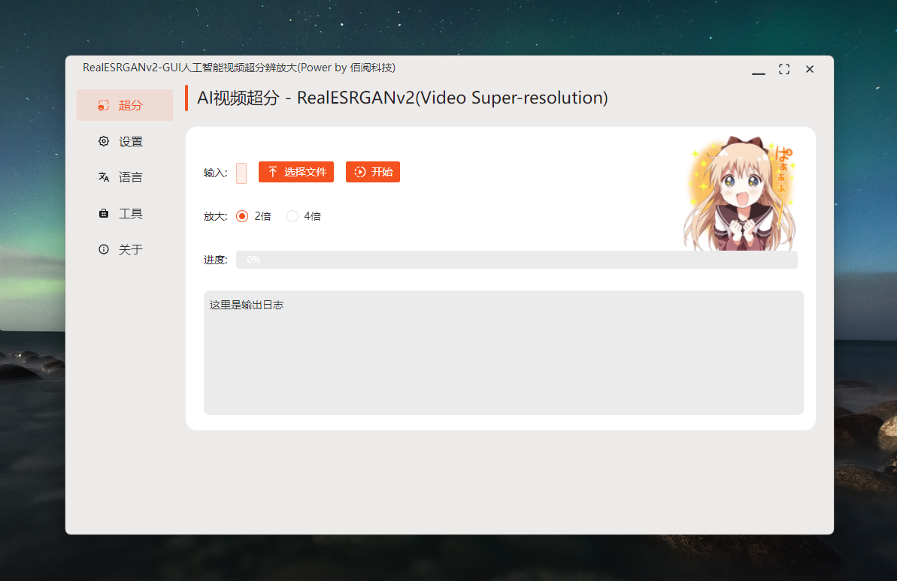

# RealESGAN-GUI动漫视频超分工具

【快捷入口：[综述](readme.md) # [RealCugan](RealCugan-GUI.md) # [RealESRGAN](RealESRGAN-GUI.md) # [Waifu2x](waifu2x-gui.md) # [ReslSR](RealSR-GUI.md)】

## 软件截图：

## 效果演示：

## 软件特点

- 操作简单、即开即用
- 支持放大2倍、3倍、4倍
- 特别适合动漫处理
- 去模糊明显
- 支持单张图片或视频放大
- 软件体积小，轻量便捷
- 支持vulkan GPU加速，低显存消耗
- 支持Windows(Mac、Linux后续补全)

## 使用场景：

- 动漫处理优秀，比waifu2x速度慢一倍，但是质量高，动漫超分最佳选择

## 案例展示

<https://user-images.githubusercontent.com/17445847/145706977-98bc64a4-af27-481c-8abe-c475e15db7ff.MP4>

<https://user-images.githubusercontent.com/17445847/145707055-6a4b79cb-3d9d-477f-8610-c6be43797133.MP4>

<https://user-images.githubusercontent.com/17445847/145783523-f4553729-9f03-44a8-a7cc-782aadf67b50.MP4>

### 视频处理

| 测试信息 | 内容                                      |
| -------- | ----------------------------------------- |
| 系统     | Windows 11                                |
| 处理器   | Intel(R) Core(TM) i9-10900K CPU @ 3.70GHz |
| 显卡     | NVIDIA GeForce RTX 2070 SUPER             |
| RAM      | 32.0 GB                                   |

源文件： 任务：放大2倍

<https://cdn.jsdelivr.net/gh/Baiyuetribe/paper2gui@main/docs/video/vsr/onepiece_demo.mp4>

实际效果：

<https://raw.githubusercontent.com/Baiyuetribe/paper2gui/main/docs/video/vsr/onepiece_demo_RealESRGANv2_2X_0429182058.mp4>

## 变更日志：

- 2022-04-29 从v2算法升级到v3，速度提升明显，可替代waifu2x成为动漫超分最佳选择

## 下载地址：

方式1：[GitHub](https://github.com/Baiyuetribe/paper2gui/releases/tag/Published)
方式2：[阿里云盘](https://www.aliyundrive.com/s/2b4hyudGkni)

## 使用反馈：

请前往：https://github.com/Baiyuetribe/paper2gui/issues

## 参考

- [xinntao/Real-ESRGAN](https://github.com/xinntao/Real-ESRGAN)
- [xinntao/Real-ESRGAN-ncnn-vulkan](https://github.com/xinntao/Real-ESRGAN-ncnn-vulkan)
- [Naive-ui](https://www.naiveui.com/zh-CN/os-theme)
- [wailsapp/wails](https://github.com/wailsapp/wails)
- [Baiyuetribe/paper2gui](https://github.com/Baiyuetribe/paper2gui)