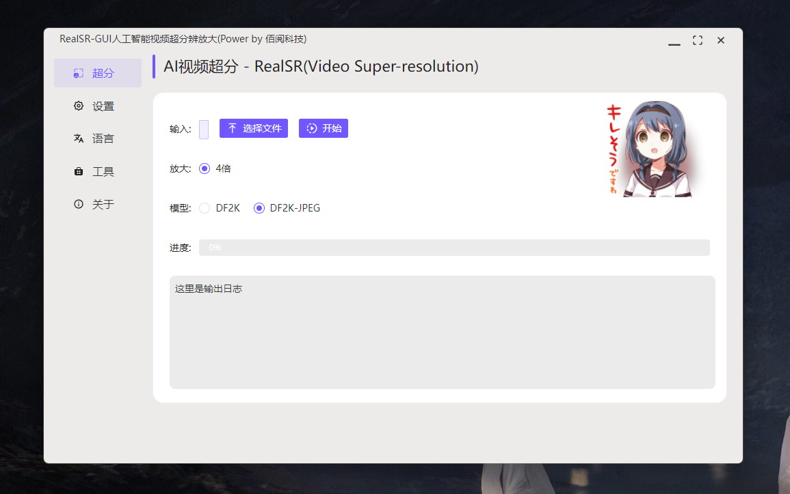

# RealSR-GUI 图片超分工具

【快捷入口：[综述](readme.md) # [RealCugan](RealCugan-GUI.md) # [RealESRGAN](RealESRGAN-GUI.md) # [Waifu2x](waifu2x-gui.md) # [ReslSR](RealSR-GUI.md)】

## 软件截图：

## 效果演示：

## 软件特点

- 操作简单、即开即用
- 支持放大4倍
- 动漫和照片处理优秀
- 支持单张图片
- 软件体积小，轻量便捷
- 支持vulkan GPU加速，低显存消耗
- 支持Windows(Mac、Linux后续补全)

## 使用场景：

- 该模型放大质量非常好，缺点也很明显，速度太慢，因此只适合处理单张图片

## 案例展示

## 下载地址：

方式1：[GitHub](https://github.com/Baiyuetribe/paper2gui/releases/tag/Published)
方式2：[阿里云盘](https://www.aliyundrive.com/s/2b4hyudGkni)

## 使用反馈：

请前往：https://github.com/Baiyuetribe/paper2gui/issues

## 参考

- [jixiaozhong/RealSR](https://github.com/jixiaozhong/RealSR)
- [nihui/realsr-ncnn-vulkan](https://github.com/nihui/realsr-ncnn-vulkan)
- [Naive-ui](https://www.naiveui.com/zh-CN/os-theme)
- [wailsapp/wails](https://github.com/wailsapp/wails)
- [Baiyuetribe/paper2gui](https://github.com/Baiyuetribe/paper2gui)