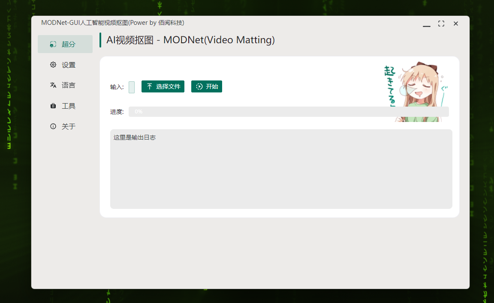

# RealCugan-GUI 动漫视频超分工具

【快捷入口：[综述](readme.md) # [MODNet](modnet_gui.md) 】

## 软件截图：

## 效果演示：

## 软件特点

- 操作简单、即开即用
- 支持任意大小图片或视频
- 软件体积小，轻量便捷
- 支持vulkan GPU加速，低显存消耗
- 抠图速度快
- 支持Windows(Mac、Linux后续补全)

## 使用场景：

- 任意需要视频抠图的场景，告别人工绿幕，节省时间

## 案例展示

### 视频处理

| 测试信息 | 内容                                      |
| -------- | ----------------------------------------- |
| 系统     | Windows 11                                |
| 处理器   | Intel(R) Core(TM) i9-10900K CPU @ 3.70GHz |
| 显卡     | NVIDIA GeForce RTX 2070 SUPER             |
| RAM      | 32.0 GB                                   |

源文件： 以demo.mp4为例，FPS为23.98，视频大小为1920*1080，视频时长为14s；在上述环境下，抠图总耗时：17.3s，平均FPS：37.9

## 特别须知：

视频处理类工具，需要缓存大量PNG格式的图片，请准备超大号的C盘空间或原视频分割成小视频后处理。

## 下载地址：

方式1：[GitHub](https://github.com/Baiyuetribe/paper2gui/releases/tag/Published)
方式2：[阿里云盘](https://www.aliyundrive.com/s/2b4hyudGkni)

## 使用反馈：

请前往：https://github.com/Baiyuetribe/paper2gui/issues

## 参考

- [bilibili/ailab](https://github.com/bilibili/ailab/edit/main/Real-CUGAN)
- [nihui/realcugan-ncnn-vulkan](https://github.com/nihui/realcugan-ncnn-vulkan)
- [Naive-ui](https://www.naiveui.com/zh-CN/os-theme)
- [wailsapp/wails](https://github.com/wailsapp/wails)
- [Baiyuetribe/paper2gui](https://github.com/Baiyuetribe/paper2gui)